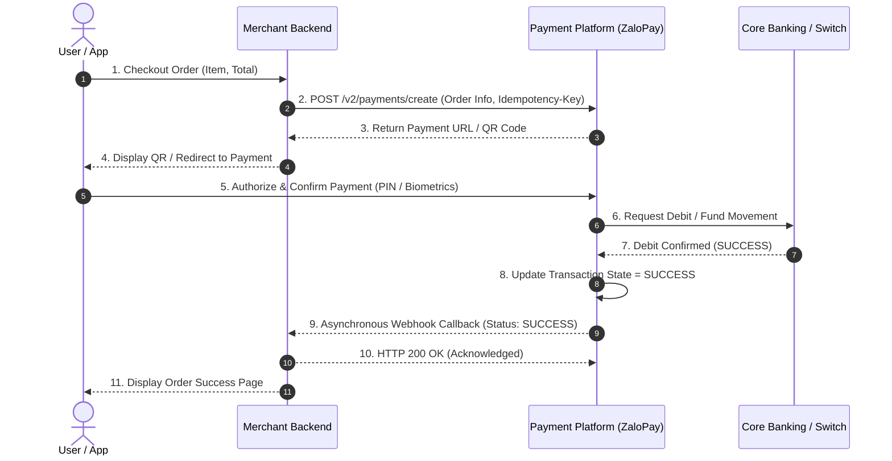
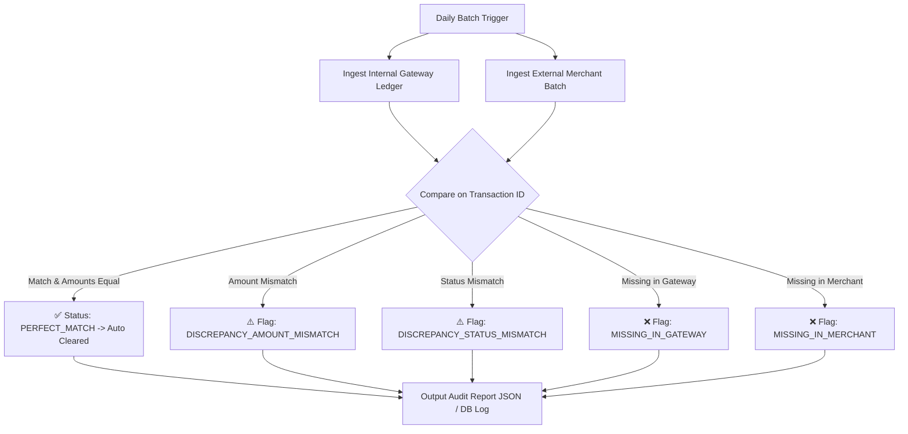

# Payment Gateway Integration & Automated Reconciliation Engine

An end-to-end Technical Product Specification & Reconciliation Engine simulating core payment transaction processing, asynchronous webhook handling, and daily ledger reconciliation between merchant settlement files and internal gateway ledgers.

---

## 📌 Project Overview
- **Role**: Associate Product Owner (Technical Platform)
- **Domain**: Payment Core Infrastructure & Financial Reconciliation
- **Stack**: Python 3.10+, PostgreSQL / SQLite, Mermaid UML, Git

This project demonstrates the core responsibilities of a Platform Product Owner at a Fintech company (e.g., ZaloPay):
1. **Product Requirement Document (PRD)** defining the transaction lifecycle state machine, idempotency key enforcement, and edge case handling.
2. **UML Sequence Diagram** illustrating asynchronous 3-party checkout interactions (Client, Merchant, Payment Gateway, Banking Switch).
3. **Relational Database Schema (`schema.sql`)** modeling core transactional logs and audit tables.
4. **Reconciliation Engine (`reconcile.py`)** automatically identifying, flagging, and categorizing 100% of amount & status mismatches.

---

## 🏛️ System Architecture & Sequence Flow



---

## 📊 Automated Reconciliation Logic

The daily reconciliation script compares **Internal Gateway Ledgers** against **Merchant Settlement Reports** to identify financial discrepancies:



---

## 🚀 How to Run the Prototype

1. **Clone the repository**:
   ```bash
   git clone [https://github.com/tranthingocvy805811-cell/payment-gateway-reconciliation.git](https://github.com/tranthingocvy805811-cell/payment-gateway-reconciliation.git)
   cd payment-gateway-reconciliation
   ```

2. **Execute the Reconciliation Engine**:
   ```bash
   python src/reconcile.py
   ```

---

## 📂 Repository Structure
```text
├── docs/
│   └── PRD_Payment_Platform.md     # Detailed functional specifications & user stories
├── sql/
│   └── schema.sql                  # Database DDL with indexes and audit tables
├── src/
│   └── reconcile.py                # Automated discrepancy matching script
└── README.md                       # Architecture, sequence diagrams & execution guide
```
